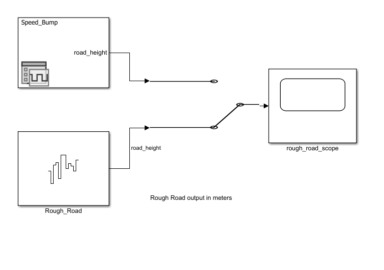
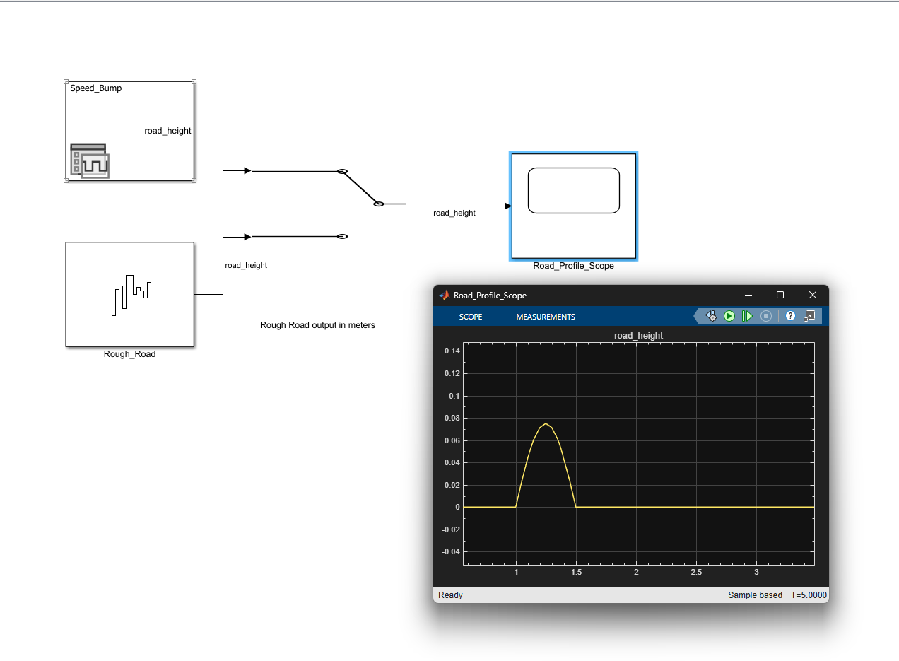
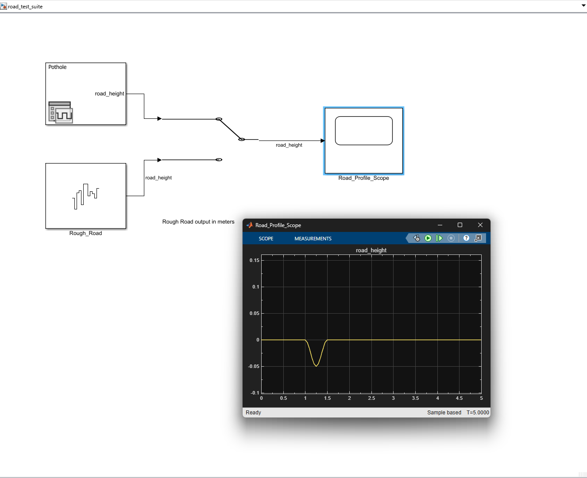
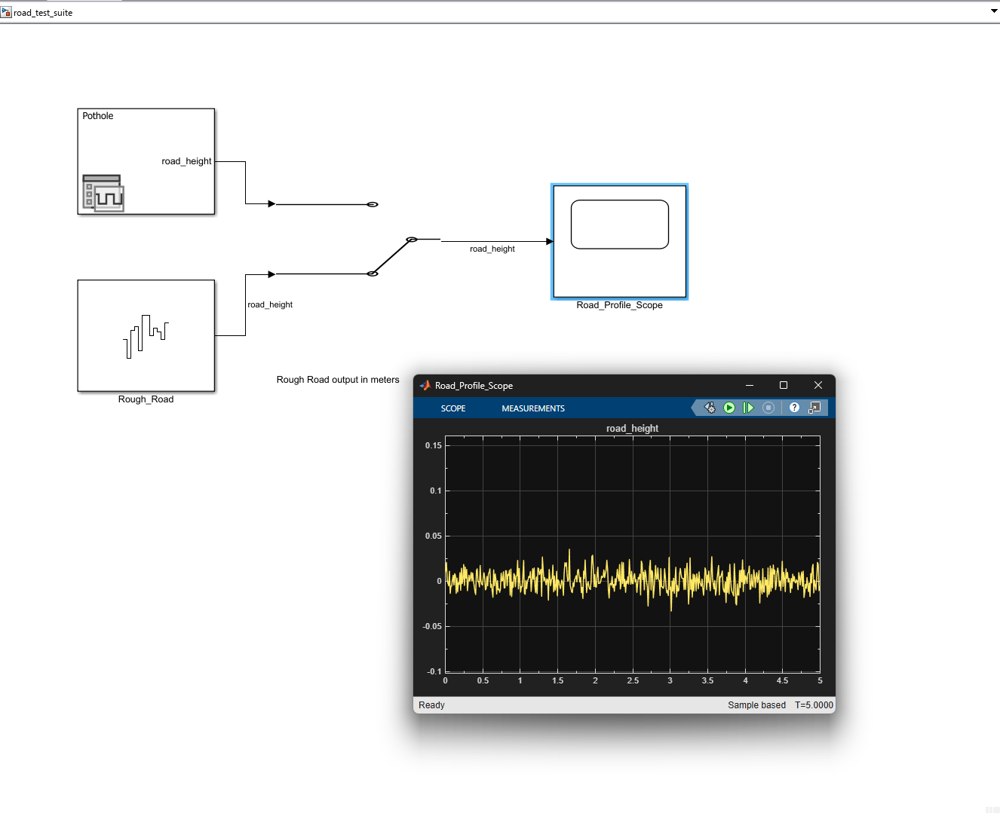

# Task 2: Road Test Suite

## Overview

This folder contains the road disturbance inputs created for the quarter-car suspension model in Simulink.

Three road cases were developed:

1. Speed hump
2. Pothole
3. Rough road

Each case outputs a vertical road-displacement signal named `road_height` in meters. The selected road input can be connected to the quarter-car model at the output of the Manual Switch.

## Files

- `road_test_suite.slx` — Simulink model containing the Signal Editor, rough-road source, Manual Switch, and Scope
- `road_profiles.mat` — Signal Editor scenarios for the speed hump and pothole
- `images/` — Scope screenshots and model-layout screenshots

## Road Cases

### Speed Bump

- Created with the Signal Editor block
- Smooth positive road displacement
- Peak height: approximately `0.075 m`
- Begins near `1.0 s`
- Ends near `1.5 s`
- Total simulation time: `5 s`

The 0.5-second disturbance represents a vehicle crossing a speed bump at an assumed regular speed.

### Pothole

- Created with the Signal Editor block
- Smooth negative road displacement
- Maximum depth: approximately `-0.05 m`
- Begins near `1.0 s`
- Ends near `1.5 s`
- Total simulation time: `5 s`

### Rough Road

- Created with a Band-Limited White Noise block
- Represents small, random vertical road disturbances
- Active throughout the full `5 s` simulation
- Output is interpreted as road displacement in meters

## Model Interface

The output after the Manual Switch is labeled:

`road_height`

This signal is meant to connect to the quarter-car model's road-displacement input. 

The Scope is included only to display and verify the selected road input.

## How to Run

1. Open `road_test_suite.slx`.
2. For the speed hump or pothole, open Signal Editor and select the desired active scenario.
3. Use the Manual Switch to choose between the Signal Editor input and the rough-road input.
4. Run the simulation for `5 s`.
5. Open `Road_Profile_Scope` to view the road-height waveform.

## Screenshots
### Simulink Road Test Suite

### Speed Hump

### Pothole

### Rough Road

## Integration Notes

- Signal name: `road_height`
- Units: meters
- Simulation duration: `5 s`
- Positive displacement represents an upward road disturbance
- Negative displacement represents a downward road disturbance
